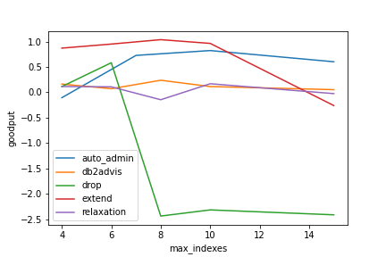
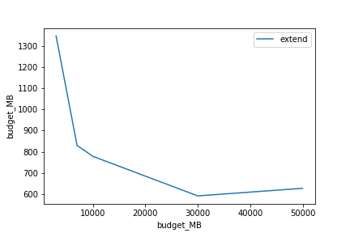
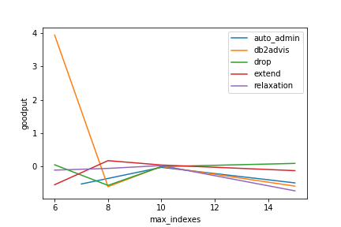
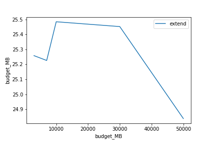

# Index Recommendation

This project adapts from the github repo of paper [_Magic mirror in my hand, which is the best in the land? An Experimental Evaluation of Index Selection Algorithms_](https://github.com/hyrise/index_selection_evaluation).

## Modifications:

- Extract a subset of queries that represent the entire workload. The provided workloads for this project are comprised of hundreds of thousands of queries and it is too inefficient to process them all.
- Sample representative parameters for each query template. The sampled params need to follow the original param distribution.
- Add additional functionalities to the database connector and cost evaluator to fit the constraints of this project.
- Fine-tune configurations that optimize for the provided workloads.
- Perform visualizations on provided workloads to determine the best algorithm.

## Visualizations and Findings

The results are limited since only a subset (about 1000-10000 queries from 200,000) are used to find indexes due to time constraint (~3 min). Longer time limit allows for more exploration and could lead to siginificantly better results.

### Epinions

- The best index size appears to be around 8.
- More storage budget limit does not usually lead to better index
- Greater-sized indexes are more complex and can potentially lead to degration in performance.

### Index Jungle

- Higher storage budget actually leads to worse performance. Therefore a lower memory budget is used for the rest of the evaluation.

- db2advis finds a significantly better solution at lower max_index cap

### Timeseries

- Similar to indexjungle, higher storage budget leads to worse performance.

- db2advis finds a significantly better solution at lower max_index cap
